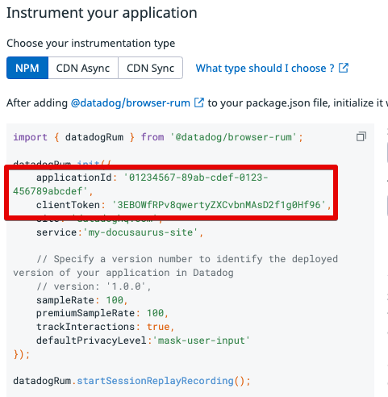

# docusaurus-plugin-datadog-rum

Integrates [Datadog RUM](https://docs.datadoghq.com/real_user_monitoring/#what-is-real-user-monitoring) with your Docusaurus site.

## Installation

```bash
npm install --save @twilio-labs/docusaurus-plugin-datadog-rum
```

**Or, if you prefer Yarn:**

```bash
yarn add @twilio-labs/docusaurus-plugin-datadog-rum
```

## Configuration

Accepted fields:

| Name            | Type     | Default                         | Description                                           |
| --------------- | -------- | ------------------------------- | ----------------------------------------------------- |
| `clientToken`   | `string` | **Required**                    | The client token for your Datadog RUM application     |
| `applicationId` | `string` | **Required**                    | The application ID for your Datadog RUM application   |
| `service`       | `string` | `"docusaurus"`                  | The name your service will show within the Datadog UI |
| `env`           | `string` | `process.env.NODE_ENV ?? "dev"` | The environment of your deployed application          |

To create your application:

1. [Login to Datadog](https://app.datadoghq.com/)
2. Choose **UX Monitoring** > **RUM Applications**
3. Click **New Application**
4. Choose **JS** (JavaScript) for the Application type
5. Enter an Application name
6. Click **Create New RUM Application**
7. Under **Instrument your application**, choose the **NPM** type and find your `clientToken` and `applicationId` in the code sample that you can copy into your `docusaurus.config.js`.



> If you already have an existing application created, instead of steps 3-6, click the **Edit Application** button next to your application and continue at step 7.

### Example configuration

#### docusaurus.config.js

```js
  plugins: [
    [
      "@twilio-labs/docusaurus-plugin-datadog-rum",
      {
        clientToken: "3EBOWfRPv8qwertyZXCvbnMAsD2f1g0Hf96",
        applicationId: "01234567-89ab-cdef-0123-456789abcdef",
        service: "my-docusaurus-site"
      },
    ],
  ],
```
